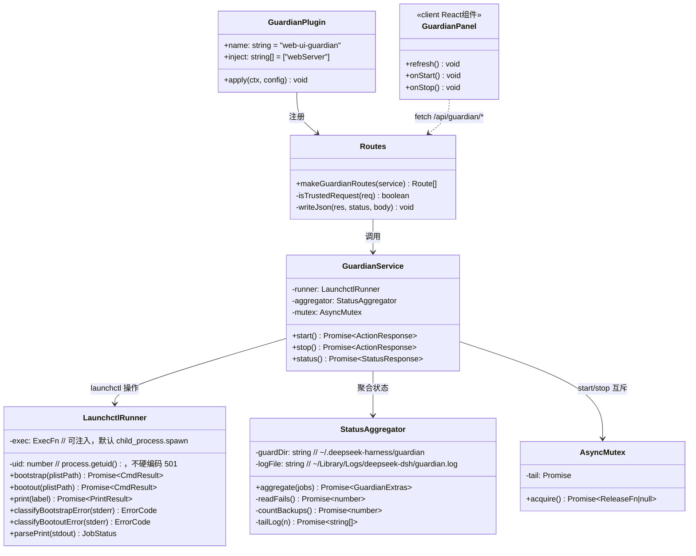
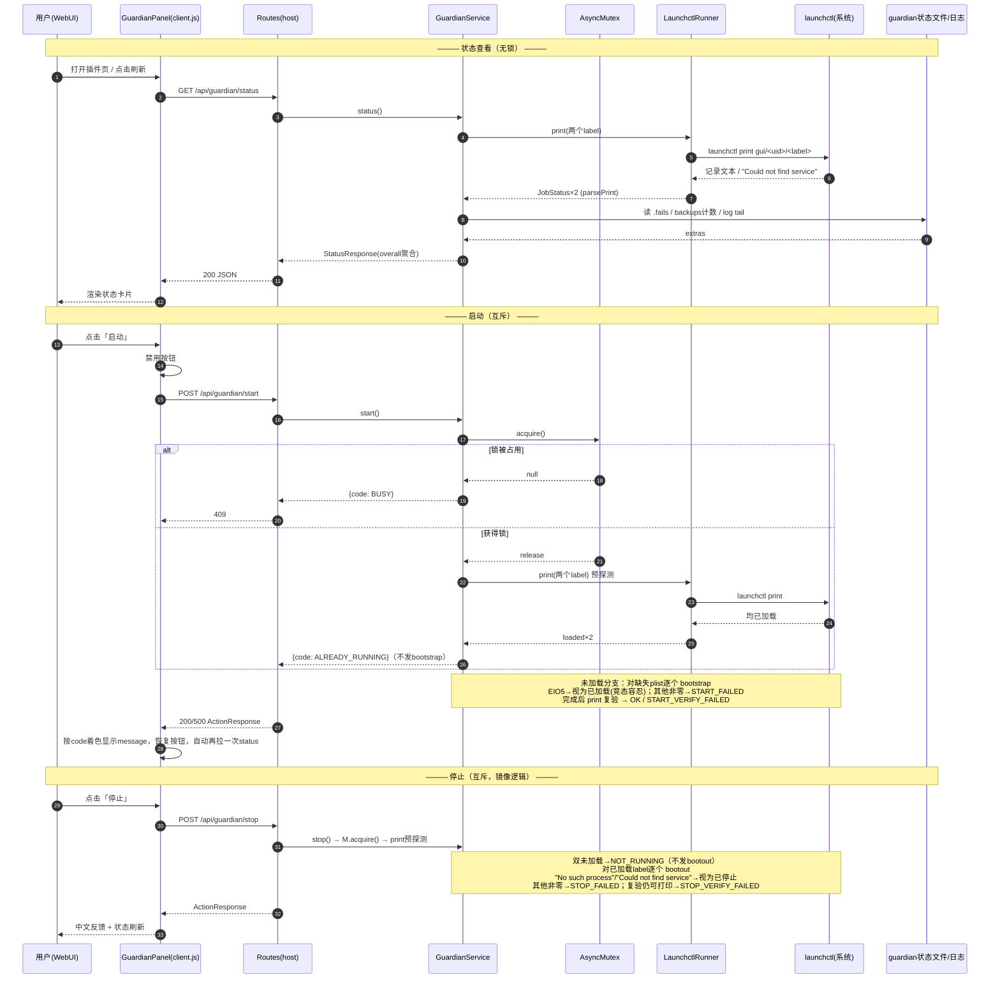
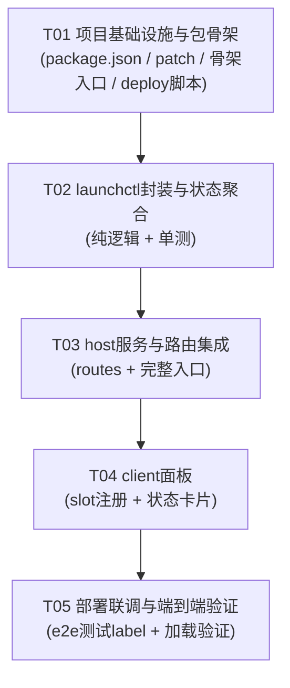

# dsh-guardian 守护脚本插件化 — 架构设计与任务分解

> 版本：v1.0（2026-09-02）
> 作者：架构师 高见远（Bob / software-architect）
> 状态：已核实生产环境事实，可直接指导实现

---

## 0. 需求理解与边界

**用户需求**：将现有 dsh-guardian 守护程序的手动终端启停，改造为 dsh 插件形式。插件须实现 dsh 插件规范的接口与集成方式，支持启动 / 停止 / 查看运行状态，并对启动失败、重复启动、停止异常等情况给出明确中文反馈。**保持现有启动停止逻辑不变，仅封装。**

**硬边界（不可逾越）**：

| 边界 | 说明 |
|---|---|
| 不改守护脚本 | `~/.deepseek-harness/bin/dsh-guardian.sh`（v1.2.1）一行不动 |
| 不改两个 plist | `com.deepseek.dsh-guardian{,-diff}.plist` 不动 |
| 启停逻辑不变 | 启动 = `launchctl bootstrap gui/<uid> <两个plist>`；停止 = `launchctl bootout gui/<uid> <两个plist>`，插件只是这套命令的封装 |
| 只追加 profile patch | 仅向 `~/.deepseek-harness/home/profiles/web/cordis.patch.yml` **追加**条目，不重写、不动 `cordis.yml`、不动 `@linxin666/dsh-web-all` 自带 patch |
| 绝不碰 dsh 主服务 | 不 bootout/kickstart `com.deepseek.dsh` / `com.deepseek.dsh-proxy`；dsh 重载只能 `launchctl kickstart -k gui/$(id -u)/com.deepseek.dsh` 且须先告知主理人 |
| guardian 状态目录只读 | `~/.deepseek-harness/guardian/`（.fails / .last-* / backups/）插件只读不写 |

**关键利好（已核实）**：插件 host 侧运行在 dsh 进程内（launchd gui 域，非沙箱），`bootstrap`/`bootout`/`print` 均可直接 `child_process` 执行，不受 WorkBuddy 沙箱对 bootstrap 的封锁影响。

---

## Part A：系统设计

### 1. 实现方案（Implementation Approach）

#### 1.1 核心技术难点与对策

| 难点 | 对策 |
|---|---|
| dsh 插件规范无公开文档 | 已从生产环境样本（`@linxin666/dsh-doctor`、`@linxin666/dsh-client-ui-task-board`）与 dsh 核心 loader 源码（`profile-boot-DG5t9aNs.js`）逆向确认全部集成点，见 §1.2 |
| launchctl 输出是人读格式、错误语义靠 stderr 文本 | 封装纯函数解析层（`launchctl.js`），exec 实现可注入，全部解析/分类逻辑可离线单测（fixtures 驱动） |
| 双 job 聚合状态判定 | "已加载" 以 `launchctl print` 可打印为准；`state = not running` 是定时 agent 空闲常态，**不作为异常**；`launchctl list` 在 macOS 26 不显示"已加载未运行"的 job，**禁止使用** |
| 浏览器端无构建链 | 面板很小（一张卡片 + 三个按钮），client.js 直接手写 `window.__ModuleLoader__.load` 包装格式 + `React.createElement`，零依赖零构建 |
| 连续点击并发 | host 侧异步互斥锁序列化 start/stop；锁占用时返回 409 BUSY；client 侧操作期间禁用按钮 |

#### 1.2 框架与样本依据（均已逐行核实）

- **cordis 插件 host 入口**：ESM 模块导出 `{ name, inject, apply(ctx, config) }`。`inject: ["webServer"]` 声明依赖 host webserver 服务；`apply` 内 `ctx.webServer.register({ kind: "exact", path, handler })` 注册 HTTP 路由，handler 为 Node `(req, res)` 风格。依据：`dsh-doctor/lib/index.js` 第 958-1084 行、`dsh-client-ui-task-board/lib/index.js` 第 2574-2638 行。
- **patch 层叠语义**：树由「package.json `dsh.profile.bundles` 各 bundle 的 patch → profile 自己的 `cordis.patch.yml` → `--patch` overlays」按序叠加而成；profile patch 是顶层 YAML 数组，支持 id 定向 config 覆盖、`disabled`、以及 **`insert` 列表**（向树中插入行）。profile 层最后应用，因此 profile 层可用 `- id: <row> / disabled: true|false` 覆盖任何 bundle 插入的行。依据：`@deepseek-ai/dsh/lib/profile-boot-DG5t9aNs.js` 第 73-106 行注释 + profile `cordis.patch.yml` 头部注释 + `dsh-web-all/cordis.patch.yml` 聚合样本。
- **insert 条目确切语法**（与 `dsh-web-all`、`dsh-doctor` 样本一致）：
  ```yaml
  - insert:
      - id: web-ui-guardian
        name: '@dsh-local/dsh-guardian'
  ```
  可选 `config:` 键传入插件配置。`name` 从 profile 根 `node_modules/` 解析；**本地包直接放入 `node_modules/<scope>/<pkg>/` 即可，免 npm 安装**。
- **客户端面板发现机制**：package.json 的 `dsh.client` 字段（`inject`: 依赖的 client runtime 包列表，`platform: web`）声明浏览器半；web GUI 将 `exports["./client"]` 以 `/plugins/<id>/client.js` 形式加载。client.js 为 `window.__ModuleLoader__.load({ id, factory })` 包装格式，`factory(require)` 内可 `require("react")`、`require("react/jsx-runtime")`，模块导出 `{ inject: [服务名...], apply(ctx) }`。
- **UI 挂载点**：全部 17 个 @linxin666 面板插件均注册到 **`web-ui.plugin.item`** slot（grep 全量核实，无其他 slot 名）：`ctx.slots.register({ name: "web-ui.plugin.item", id, order, locale, inject }, ReactComponent)`，出现在 WebUI 插件管理页。本插件沿用同一 slot，不发明新挂载点。
- **client → host 调用**：样本插件均走「host webServer 路由 + 浏览器 `fetch`」模式（doctor 的 `/api/doctor/*`、task-board 的 HttpTaskBoardHostTransport），而非 cordis 服务 RPC。本插件沿用。
- **路由安全围栏**：doctor 的 loopback 守卫（socket 回环地址 + Host 回环 + 浏览器同源标记）。本插件采用同款（见 §5 未决事项中关于远程访问的说明）。

#### 1.3 架构模式

经典**前后半分离的 cordis 双面插件**（dual-face plugin）：

```
浏览器 (client.js)  ──fetch──▶  dsh webServer 路由 (routes.js)
                                      │
                                      ▼
                              GuardianService (互斥锁序列化)
                                      │
                    ┌─────────────────┼──────────────────┐
                    ▼                 ▼                  ▼
              launchctl.js     guardian-state.js    （只读文件）
           bootstrap/bootout    print 解析 + .fails   backups/ 计数
                /print          + backups + log tail   guardian.log
```

### 2. 文件清单

开发源根目录：`/Users/apple/WorkBuddy/2026-09-02-21-05-27/dsh-guardian-plugin/`

| 文件 | 说明 |
|---|---|
| `package/package.json` | 包清单：name=`@dsh-local/dsh-guardian`，`type: module`，`main: lib/index.js`，`exports["./client"]`，`dsh.engines/bundle.patch/client.inject/client.platform` |
| `package/cordis.patch.yml` | 包自带 bundle patch（insert 自身行），供聚合/独立安装场景使用 |
| `package/lib/index.js` | host 入口（ESM）：导出 `name`/`inject`/`apply`，mountOnce 防重，注册路由与清理 |
| `package/lib/launchctl.js` | launchctl 封装：spawn 执行 + `print` 输出解析 + bootstrap/bootout 错误分类（**纯函数可测**，exec 可注入） |
| `package/lib/guardian-state.js` | 状态聚合：双 job print + `.fails` + `backups/` 计数 + `guardian.log` 尾部 N 行 → StatusResponse |
| `package/lib/mutex.js` | 异步互斥锁（promise 链），start/stop 串行化 |
| `package/lib/routes.js` | webServer 路由定义 + loopback 同源守卫 + JSON 读写辅助 |
| `package/client.js` | 浏览器半：ModuleLoader 包装，`web-ui.plugin.item` slot 注册面板卡片（状态展示 + 启动/停止/刷新按钮 + 中文反馈） |
| `scripts/deploy.sh` | 部署：备份 profile patch → 拷贝包到 profile `node_modules/@dsh-local/dsh-guardian/` → 幂等追加 insert 条目 → 输出重载提示（**不自行 kickstart**） |
| `scripts/undeploy.sh` | 卸载：移除 insert 条目 + 删除包目录（先备份 patch） |
| `test/fixtures/*.txt` | launchctl 各分支输出样本（print 已加载/未加载、EIO5、No such process 等） |
| `test/launchctl.parse.test.mjs` | 解析与错误分类单测（`node --test`，零依赖） |
| `test/guardian-state.test.mjs` | 状态聚合单测（临时目录模拟 guardian 状态文件） |
| `test/e2e-test-label.sh` | 端到端：测试专用 label `com.deepseek.dsh-guardian-plugin-test` 全分支验证 |
| `docs/architecture.md` | 本文档 |

### 3. 数据结构与接口

#### 3.1 类图（Mermaid）



#### 3.2 常量与数据模型

```js
// 管理的两个 LaunchAgent（顺序即操作顺序）
const JOBS = [
  { label: "com.deepseek.dsh-guardian",      plist: "~/Library/LaunchAgents/com.deepseek.dsh-guardian.plist" },
  { label: "com.deepseek.dsh-guardian-diff", plist: "~/Library/LaunchAgents/com.deepseek.dsh-guardian-diff.plist" },
];
// 可用环境变量 DSH_GUARDIAN_JOBS 覆盖（JSON），供 e2e 测试指向测试 label——生产默认即上表
```

**JobStatus**（单 job）：
```json
{
  "label": "com.deepseek.dsh-guardian",
  "loaded": true,
  "state": "not running",
  "runs": 45,
  "lastExitCode": 0,
  "pid": null
}
```
- `loaded` = `launchctl print gui/<uid>/<label>` 退出码 0 且能解析出记录（未加载时 print 报错：`Could not find service "..." in domain`）
- `state` 原样透传 print 输出；`"not running"` 为定时 agent 空闲常态

**StatusResponse** — `GET /api/guardian/status`：
```json
{
  "ok": true,
  "overall": "active",
  "jobs": [ JobStatus, JobStatus ],
  "guardian": {
    "fails": 0,
    "backupCount": 3,
    "lastLogLines": ["2026-09-03 07:08:11 [START] dsh-guardian v1.2.1 mode=scan"]
  },
  "checkedAt": "2026-09-03T07:08:30.000Z"
}
```
- `overall` 枚举：`"active"`（双 loaded）/ `"partial"`（单 loaded，**异常**）/ `"stopped"`（双未加载）
- `.fails` / `backups/` / 日志文件缺失时对应字段为 `0` / `0` / `[]`（容忍缺失，不报错）

**ActionResponse** — `POST /api/guardian/start` 与 `POST /api/guardian/stop`：
```json
{
  "ok": false,
  "action": "start",
  "code": "ALREADY_RUNNING",
  "message": "守护程序已在运行中，无需重复启动",
  "jobs": [ JobStatus, JobStatus ],
  "detail": "Bootstrap failed: 5: Input/output error"
}
```
- `detail` 为原始 stderr 摘要（截断至 500 字符），供排查；用户只看 `message`

#### 3.3 HTTP 接口表

| 方法 | 路径 | 成功 | 失败 | 说明 |
|---|---|---|---|---|
| GET | `/api/guardian/status` | 200 StatusResponse | 403（非回环）| 不加锁，随时可查 |
| POST | `/api/guardian/start` | 200 ActionResponse | 403 / 409 BUSY / 500 | 互斥锁内执行 |
| POST | `/api/guardian/stop` | 200 ActionResponse | 403 / 409 BUSY / 500 | 互斥锁内执行 |

操作语义（**先探测、后动作、再验证**）：
- **start**：先 `print` 双 label → 双 loaded 直接返回 `ALREADY_RUNNING`（不发 bootstrap）；仅对未加载的 plist 执行 `bootstrap`；单 job bootstrap 报 EIO5 视为该 job 已加载（竞态容忍），其他非零即 `START_FAILED`；完成后再次 `print` 验证双 loaded。
- **stop**：先 `print` → 双未加载直接返回 `NOT_RUNNING`（不发 bootout）；仅对已加载的 label 执行 `bootout`；bootout 报 "No such process"/"Could not find service" 视为该 job 已不在（竞态容忍），其他非零即 `STOP_FAILED`；完成后 `print` 验证双不可打印，仍可打印则 `STOP_VERIFY_FAILED`。

### 4. 错误分类法（反馈分支全表）

判定均基于 launchctl 退出码 + stderr 文本匹配 + 操作后 `print` 验证。

| # | 场景 | 判定依据 | code | HTTP | 中文反馈文案（message） |
|---|---|---|---|---|---|
| 1 | 启动成功 | 所需 bootstrap 全 exit 0，复验双 loaded | `OK` | 200 | 守护程序已启动（定时巡检与变更侦测均已加载） |
| 2 | 重复启动 | 操作前探测双 loaded；或 bootstrap stderr 含 `Bootstrap failed: 5: Input/output error` | `ALREADY_RUNNING` | 200 (ok:false) | 守护程序已在运行中，无需重复启动 |
| 3 | 启动失败 | bootstrap 非零且非 EIO5 | `START_FAILED` | 500 | 守护程序启动失败，请检查 plist 文件与系统日志（详情附后） |
| 4 | 启动后验证失败 | bootstrap exit 0 但复验仍有未 loaded | `START_VERIFY_FAILED` | 500 | 启动指令已执行但服务未正常加载，请在终端运行 launchctl print 检查 |
| 5 | 停止成功 | 所需 bootout 全 exit 0，复验双不可打印 | `OK` | 200 | 守护程序已停止 |
| 6 | 未运行停止 | 操作前探测双未加载；或 bootout stderr 含 `No such process` / `Could not find service` | `NOT_RUNNING` | 200 (ok:false) | 守护程序当前未在运行，无需停止 |
| 7 | 停止异常 | bootout 其他非零错误 | `STOP_FAILED` | 500 | 守护程序停止失败（详情附后），请重试或在终端手动执行 bootout |
| 8 | 停止后仍在 | bootout exit 0 但复验仍可打印 | `STOP_VERIFY_FAILED` | 500 | 停止指令已执行但服务仍在运行，请重试 |
| 9 | 部分运行（状态页展示） | status 时仅单 job loaded | `overall=partial` | 200 | 状态异常：两个守护任务仅一个在运行，建议先停止再重新启动 |
| 10 | 操作冲突 | 互斥锁被占用 | `BUSY` | 409 | 正在执行上一个操作，请稍候 |
| 11 | 内部错误 | 未捕获异常（spawn 失败、文件读取异常等） | `INTERNAL` | 500 | 插件内部错误：<异常摘要> |
| 12 | 非本机访问 | 非回环请求 | — | 403 | （JSON `{ok:false,error:"forbidden: loopback-only"}`） |

client 面板按 `code` 着色：`OK` 绿、`ALREADY_RUNNING`/`NOT_RUNNING` 黄（提示非故障）、`BUSY` 灰、其余红。

### 5. 程序调用流（Mermaid 时序图）



**host 插件加载流程**（dsh 重载时）：loader 组合 patch 层 → 遇到 insert 行 `web-ui-guardian` → 从 profile `node_modules/@dsh-local/dsh-guardian` 解析 `main` → 调 `apply(ctx)` → mountOnce 去重 → `makeGuardianRoutes()` → 逐条 `ctx.webServer.register(route)` → `ctx.effect` 返回清理函数（dispose 时反注册路由）。

### 6. 并发与锁

- **host 互斥**：`AsyncMutex`（promise 链，`tail = tail.then(task)` 的 tryAcquire 变体）。start/stop 必须持锁；锁占用时立即返回 409 BUSY（不排队——用户场景无排队价值）。status 不加锁。
- **client 防抖**：任一操作进行中禁用全部操作按钮；操作完成后立即拉取一次 status；面板挂载后每 5s 轮询 status（`ctx.effect` 清理定时器）。
- **与 guardian 自身调度的边界**：插件只调 `launchctl bootstrap/bootout/print`，**绝不执行** `dsh-guardian.sh`，**绝不写** `~/.deepseek-harness/guardian/` 任何文件。guardian 的 diffcheck 侦测到 patch 变更记日志属预期行为，插件不干预。
- **bootout 幂等窗口**：bootout 后 launchd 移除记录有毫秒级延迟，复验前 `await sleep(300ms)`，避免误报 STOP_VERIFY_FAILED。

### 7. 未决事项与假设（Anything UNCLEAR）

1. **远程访问**：路由围栏默认 loopback-only（doctor 同款）。本 profile 启用了 `web-ui-remote-web-ui`，若主理人需要从 LAN 远程操作启停，需追加 task-board 式 trusted-proxy 白名单机制（v1 不做，假设本地使用）。**请主理人确认**。
2. **面板挂载点**：采用全体样本共用的 `web-ui.plugin.item` slot（出现在 WebUI 插件管理页/设置页卡片列表）。若希望放侧边栏一级入口，需要另行侦察 sidebar slot 的注册协议（v1 不做）。
3. **client.js 手写 ModuleLoader 包装**：免去构建链，代价是不能用 JSX（用 `React.createElement`）。面板复杂度低，可接受。若后续面板膨胀再引入 tsdown。
4. **uid 获取**：host 内 `process.getuid()`，失败时回退执行 `id -u`；两处均失败则返回 `INTERNAL`。不硬编码 501。
5. **包名假设**：`@dsh-local/dsh-guardian`，scope 系自拟，已与 profile `node_modules` 现有包比对无撞名。insert 行 id `web-ui-guardian` 与现有 `web-ui-*` 命名一致，且不与现有 18 个行 id 冲突（已逐一比对）。

---

## Part B：任务分解

### 8. 依赖包（Required Packages）

本插件**零第三方运行时依赖**（host 用 Node 内置模块，client 用 dsh 运行时提供的 React）。开发/测试亦零依赖（`node --test`）。

```
（无第三方包；react 由 dsh client runtime 经 ModuleLoader require 提供）
```

运行环境要求：Node `^22.19.0 || >=24`（与 dsh `engines` 对齐）；dsh `>=0.1.1-rc.1`（`dsh.engines.dsh` 声明）。

### 9. 任务列表（按实现顺序）

| Task ID | 任务名 | 源文件 | 依赖 | 优先级 |
|---|---|---|---|---|
| T01 | 项目基础设施与包骨架 | `package/package.json`、`package/cordis.patch.yml`、`package/lib/index.js`（骨架：mountOnce + 空路由注册）、`scripts/deploy.sh`、`scripts/undeploy.sh` | — | P0 |
| T02 | launchctl 封装与状态聚合（纯逻辑，可离线单测） | `package/lib/launchctl.js`、`package/lib/guardian-state.js`、`package/lib/mutex.js`、`test/fixtures/*`、`test/launchctl.parse.test.mjs`、`test/guardian-state.test.mjs` | T01 | P0 |
| T03 | host 服务与路由集成 | `package/lib/routes.js`、`package/lib/index.js`（完整版：GuardianService 装配 + 路由注册 + 清理） | T02 | P0 |
| T04 | client 面板 | `package/client.js`（ModuleLoader 包装 + slot 注册 + 状态卡片 + 三按钮 + 中文反馈着色） | T03 | P0 |
| T05 | 部署联调与端到端验证 | `scripts/deploy.sh`（联调修正）、`test/e2e-test-label.sh`、`docs/architecture.md`（验证清单补充） | T04 | P1 |

**部署纪律（T05 执行时）**：deploy.sh 只完成「备份 patch → 拷包 → 幂等追加 insert 条目」；**dsh 重载（`launchctl kickstart -k gui/$(id -u)/com.deepseek.dsh`）必须先告知主理人，由主理人确认后执行**。备份命名 `cordis.patch.yml.bak-<yyyymmddhhmmss>`，与现有 `.bak-20260901` 惯例一致。

### 10. 共享约定（Shared Knowledge）

```
- 全部 API 响应为 { ok: boolean, ... }；失败时 ok:false + code + message（中文）
- code 枚举：OK / ALREADY_RUNNING / START_FAILED / START_VERIFY_FAILED /
  NOT_RUNNING / STOP_FAILED / STOP_VERIFY_FAILED / BUSY / INTERNAL
- uid 一律 process.getuid() 动态获取，禁止硬编码 501
- 状态判据只用 launchctl print；禁止使用 launchctl list（macOS 26 不显示已加载未运行的 job）
- "state = not running" 是定时 agent 常态，不等于异常；异常仅指 partial / lastExitCode != 0（仅提示，不判红）
- 时间戳统一 ISO 8601 UTC（checkedAt）
- host 代码为 ESM；client.js 为 ModuleLoader 包装格式（非 ESM），导出 { inject, apply }
- launchctl stderr 截断至 500 字符进 detail 字段
- 测试 label：com.deepseek.dsh-guardian-plugin-test（测试专用，绝不碰生产两个 label）
- 生产 label 只读探测 + 用户显式点击才动作；任何自动化测试不得对生产 label 执行 bootstrap/bootout
```

### 11. 测试方案要点（QA 指引）

**不依赖用户 Terminal 的三层验证**：

1. **离线单测**（`node --test`，任何环境可跑）：
   - `launchctl.parse.test.mjs`：fixtures 驱动覆盖 parsePrint（loaded / not running / running+pid / 未加载报错）、classifyBootstrapError（EIO5→ALREADY_RUNNING、其他→START_FAILED）、classifyBootoutError（No such process / Could not find service→NOT_RUNNING、其他→STOP_FAILED）。exec 注入假实现。
   - `guardian-state.test.mjs`：临时目录模拟 .fails 存在/缺失/非数字、backups 空/非空、日志缺失/多行，验证 extras 聚合与容错。
2. **端到端（测试 label）**：`test/e2e-test-label.sh` 生成副本 plist（label=`com.deepseek.dsh-guardian-plugin-test`，`ProgramArguments=/bin/true`），设 `DSH_GUARDIAN_JOBS` 指向测试 label，启动独立 host 进程跑 GuardianService，依次验证：stop(未运行)→NOT_RUNNING、start→OK、start→ALREADY_RUNNING、stop→OK、stop→NOT_RUNNING；并注入损坏 plist 验证 START_FAILED。结束后清理测试 label。**全程不碰生产 label。**
3. **插件加载验证**（deploy 后，须主理人确认 kickstart）：
   - `pgrep -fl "dsh"` 确认 dsh 进程存活且未崩溃重启（对照 launchctl print 的 runs 计数）；
   - `curl --noproxy '*' -s http://127.0.0.1:<webPort>/api/guardian/status` 返回 ok:true；
   - WebUI 插件管理页出现「守护程序」卡片，手工点击启动/停止验证 #1-#12 反馈分支；
   - guardian diffcheck 日志出现 patch 变更记录（预期行为，非故障）。

### 12. 任务依赖图



---

## 附：关键侦察证据索引

| 事实 | 证据位置 |
|---|---|
| patch 层叠顺序与 profile 层最后应用 | `@deepseek-ai/dsh/lib/profile-boot-DG5t9aNs.js` 第 73-106 行 |
| insert 语法 | `dsh-web-all/cordis.patch.yml`、`dsh-doctor/cordis.patch.yml` |
| host 入口 `{name, inject, apply}` + webServer.register | `dsh-doctor/lib/index.js` 第 958-1084 行 |
| mountOnce 防重模式 | `dsh-doctor/lib/index.js` 第 917-956 行 |
| client ModuleLoader 包装 + slot 注册 | `dsh-client-ui-task-board/lib/client.js` 第 1-13、3910-3960 行 |
| `web-ui.plugin.item` 为唯一样本 slot | `grep -rhoE 'web-ui\.[a-z.]+' node_modules/@linxin666/*/lib/*.js` 全量 18 处 |
| launchctl print 输出格式 | 本机实测 `launchctl print gui/501/com.deepseek.dsh-guardian`（state/runs/last exit code 字段位置） |
| guardian 状态文件命名 | `dsh-guardian.sh` 第 281-334 行（.fails / .last-proxy-notify / .last-down-notify / .last-recover） |
